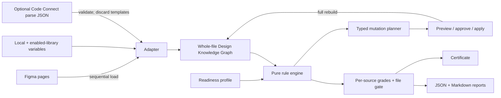

# Architecture

## Design principle

The plugin never equates “selected” with “known.” A target may be one selected frame, but analysis always uses a complete file-wide knowledge snapshot.

## Subsystems

### Figma adapter

`src/figma/adapter.ts` owns dynamic page loading, traversal, component/instance relationships, variable discovery, annotations, dev-resource counts, and normalized snapshots.

- `figma.skipInvisibleInstanceChildren = true` is enabled before traversal.
- Pages call `page.loadAsync()` sequentially.
- Traversal is iterative, yields every 500 nodes, reports progress, and checks cancellation.
- Invisible instance internals remain skipped unless a future rule explicitly requires them.
- Dev-resource URLs are counted but never stored or fetched.
- Text characters are not copied into the graph; only length and fingerprint are retained.

### Whole-file Design Knowledge Graph

`DesignKnowledgeGraph` is in-memory and contains:

- page roles and coverage;
- normalized nodes and parent/child relationships;
- component definitions, instances, and main-component relationships;
- approved local and enabled-library variable descriptors;
- inferred and applied variable bindings;
- responsive specimen families;
- repeated structural groups;
- designated source-frame IDs;
- verified Code Connect evidence without templates or source paths;
- a deterministic snapshot hash over code-relevant design facts.

The graph is reusable by a future REST/CLI adapter because no Figma runtime objects enter the pure rule engine.

### Pure rule engine

`src/core/rules.ts` accepts only a graph, a profile, and target IDs. It returns deterministic `Finding` records with measured evidence, node paths, source references, confidence, fixability, and optional pattern resolution.

Node-linked punch-list entries that explain an aggregate failure can set `scoreImpact: false`; this prevents one underlying defect from being deducted twice while preserving navigation and repair detail.

### Grading and report builder

`src/core/grading.ts` groups findings by rule and source root, applies severity weights, computes all eight axis scores, and applies axis multipliers. `src/core/report.ts` grades every source independently and uses the limiting frame for the file result.

### Mutation planner and executor

`src/core/planner.ts` converts only explicitly fixable findings to typed operations. `src/figma/mutations.ts` owns Figma writes, version checkpoints, undo boundaries, clone validation, postconditions, and rollback.

### React UI

`src/ui` provides profile setup, scan scope, progress/cancellation, grade and blocker summaries, filtered findings, pattern confirmation, cleanup review, context inventory, Code Connect import, token creation, certification, and report export. React text rendering is used throughout; no untrusted HTML is injected.

## Context freshness

A graph is fresh only when it is complete and no older than 15 minutes. Any document change marks it dirty. Certification requires:

- a complete graph covering every page;
- a report tied to the same graph hash;
- grade B or better for every designated source frame;
- no blockers;
- no unresolved severity-4 reviews.

Certificate metadata stores the graph hash, report hash, ruleset version, catalog version, and timestamp. A later scan compares existing certificates with the rebuilt graph and reports stale metadata.
