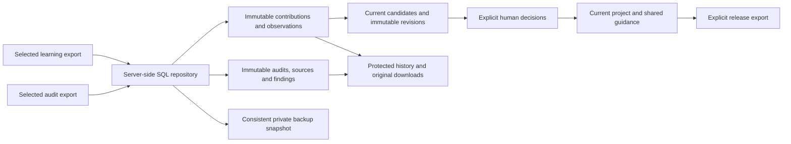

# Existing export capture and database architecture review

## Outcome and scope

The user authorized importing existing companion exports, checking the actual
hosted capture, and reviewing the database structure against repository and
Supabase standards. The user subsequently requested deletion of the imported
source files instead of archiving them. This assessment covers source at
`9375fb5`, its two committed migrations, and the dedicated hosted project.
No application code or schema changed during this review.

Two existing audit reports and the full/filtered learning envelopes were selected.
Their contracts and learning digests passed before import. Their original explicit
project scope, payloads, digests and source dates were preserved. These are existing
local exports imported into hosted Supabase, distinct from the earlier synthetic
acceptance fixtures and from a fresh native Figma capture.

**No high-confidence vulnerabilities identified in the reviewed scope.** The
current design follows the selected local, single-operator architecture. It is
not a team authorization model or a team-load capacity result.

## Captured records

Counts below describe only the selected project scope.

| Table | Records | Capture verified |
| --- | ---: | --- |
| Projects | 1 | Existing explicit source scope |
| Audits | 2 | Canonical reports, SHA-256, semantic identity, grade/readiness |
| Original audit exports | 2 | Complete JSON values and canonical SHA-256 |
| Findings | 122 | All 61 findings per audit, rule/status columns and JSON payloads |
| Learning contributions | 2 | Validated envelope IDs, producer metadata and complete payloads |
| Observations | 49 | All 39 full-export and 10 filtered-export occurrences |
| Current candidates | 39 | Digests and derivation match the imported evidence |
| Candidate revisions | 39 | Initial revisions retained; overlapping evidence adds none |
| Decisions | 0 | No human approval, rejection or deferral was made |
| Project guidance packs | 1 | Empty facts; no guidance automatically published |

Audits were imported first. That stage created no contributions, observations,
candidates, revisions, decisions or project packs. Learning imports then generated
drafts atomically. The full and filtered envelopes share a semantic report identity;
sets keyed by that identity keep candidate support/contradiction counts at one per
source rather than counting the overlapping export twice. Existing synthetic
evidence, decisions and all three previous guidance packs remain unchanged.

Source timestamps remain in the original JSON and relational `source_at` fields;
`received_at` records the new import. Each original payload was compared as a JSON
value against database read-back. JSONB/downloads preserve values and canonical
hashes, not original indentation or key order.

Retrying both audit files and both learning files reported duplicates and left all
counts unchanged. Fresh CLI and production companion processes read the same rows.
After source deletion, a fresh CLI read still returned these counts.

## Relationships and provenance

The selected audits and learning envelopes contain different semantic report
identities. They remain unlinked in both APIs and detail pages. Audit preview returns
no suggested scope from those contributions. Neither filenames, close timestamps,
matching grades nor shared project names establish a link.

The older pre-target identity calculation was also checked and did not match these
learning envelopes. Source history shows the later addition of target identity, but
that alone does not establish the cause of this particular mismatch. A matching
source audit is needed to establish a positive link for these contributions; the
selected files do not provide one. This is an evidence limitation, not a confirmed
repository defect. Current-contract matching in either order and ambiguity are
covered by local fixtures; earlier hosted synthetic matching remains separate
recorded evidence.

## Structure and architecture

| Standard | Current evidence and assessment |
| --- | --- |
| Relational integrity | Ten private tables; validated primary/unique/state constraints and project-qualified child relationships. UUID audit/request identities, typed booleans and timestamptz values. JSONB retains validated source objects; column/payload fences protect mutable identities. |
| Foreign-key indexes | Live catalog inspection found no foreign key without a valid index covering its leading columns. History/date, semantic identity, finding/observation and full-text indexes match repository query paths. |
| Least privilege | Migration owner is separate. The NOLOGIN application group and runtime login lack superuser, bypass-RLS, role/database creation and replication. Neither is a member of the owner role. Runtime updates are limited to project display name, candidate digest/payload and pack payload. |
| Immutable history | Runtime has no DELETE/TRUNCATE or broad UPDATE. Fourteen actual hosted update/delete attempts against evidence, revisions and decisions were denied with 42501, including zero-row statements. |
| RLS and exposure | All ten tables have RLS. Policies target the application group. Anonymous, authenticated and service roles have no application column access; anonymous/authenticated roles lack schema USAGE. No application functions or sequences exist. Data API disabling remains previously recorded provisioning evidence; the dashboard setting was not rechecked in this review. |
| Transactions | CLI/routes share bounded transactions and the same transaction-scoped advisory lock. Imports commit evidence and derived state together; source/read-only snapshots use repeatable read. SQL uniqueness, expected-digest updates and request UUID decisions address retries. External filesystem/network work is outside application write transactions. |
| Connections | Actual application TLS socket negotiated authorized TLS 1.3 with the configured CA/hostname verification. Postgres.js 3.4.9 uses a lazy two-connection session pooler client. Two reserved sessions reached distinct hosted backend PIDs. Transaction-local limits were 15 seconds for statements and two seconds for locks. |
| Lock contention | Two real hosted sessions contended on the repository lock. The second returned busy/423 after about 2.17 seconds; releasing the first completed normally. This check committed no evidence or decision. |
| Application boundaries | Server-only configuration, parameterized SQL, local capability authentication, exact loopback Host checks and same-origin mutations. Streamed upload limits precede parsing. Actual protected endpoints and original downloads denied unauthenticated requests. Rendered review/history HTML contained no configured database credential or CA. |
| Exports and recovery | Consistent database snapshots, new private destinations, atomic writes and completion manifest last. Both backups verified every listed SHA-256 and mode 0700/0600. Full database-only history and compatible knowledge paths are retained. Committed plugin release JSON remains an explicit build input. |
| Migrations | Hosted versions 20261004193926 and 20261004210730 match committed forward migrations. Applied files were not changed. |

Reviewed source: `src/companion/database.ts`, `repository.ts`, `imports.ts`,
`exports.ts`, `filesystem.ts`, the core knowledge-loop/stable contracts, companion
server access/history helpers, proxy, import/detail/download routes, and both SQL
migrations. Repository tests supply rollback, stale edits/approvals, wrapper
preservation, project-boundary and decision-replay coverage without hosted writes.

The live `pg_stat_ssl` row describes Supavisor's database-side backend and reported
no backend TLS. It is not evidence about the application's client connection.
Client encryption/authorization was observed on the actual Node TLS socket, rather
than inferred from that backend view. The internal pooler-to-database transport was
not independently attested here.

## Browser and query evidence

A fresh production build in a separate worktree served the hosted database with the
restricted runtime role. Playwright verified both histories, grade/readiness/status
filters, audit/learning details, 61 displayed findings, review queue and an original
browser download equal to its source payload. Unlinked identities and the absence
of human decisions were visible. Protected endpoints, wrong Host and cross-origin
writes returned 403; page errors were absent. Owned servers and browsers were
closed. Earlier shared-build/bootstrap and overly strict selector probes failed;
only completed isolated-build checks count as acceptance.

Natural hosted EXPLAIN ANALYZE checks measured approximately 0.097 ms for scoped
audit history, 0.081 ms for learning history and 0.200 ms for audit search on this
small dataset. These timings are not scale/load acceptance. The final performance
advisor check returned only four informational unused-index observations, for
`audits_date`, `audits_grade`, `audits_search` and `contributions_search`. Keep these
indexes until representative query usage supports a change; tiny datasets can
favor other paths. See the [unused-index advisor guidance](https://supabase.com/docs/guides/database/database-linter?lint=0005_unused_index).
Security advisors returned no findings.

`DESIGN_PASSPORT_E2E_PORT=5293 pnpm run verify:ci` passed: 551 tests across 52
repository files, eight production browser tests, builds, type checks, lint,
catalog/schema/release consistency, wiki integrity and skill checks. Those tests
use local synthetic fixtures; the hosted existing-export checks above are separate.

## Cleanup and remaining boundaries

The pre-import backup verified 12 files. The post-import backup verified 16 files
and all ten table counts. Database backups were moved to a private location outside
the project and verified again. The four selected source exports were then deleted
without creating an archive of their original files. A temporary extracted target
report and redundant verification snapshot were also removed; they were not
additional imports. Schema/configuration, committed release JSON and unselected
reference/batch inputs remain. Older batch configurations that reference a deleted
report require a fresh selected report before reuse.

Remaining work before team rollout is a separate authenticated access/tenancy and
hosting design, production/test environment separation, backup retention/restore
operations and capacity validation. The application currently serializes learning
derivations and reads the full learning state; review that cost against measured
volume when planning team capacity. There is no runtime delete/reset operation.
This review did not approve guidance, clean database history, provision production,
start team hosting, or rerun an independent implementation-review model workflow.

Standards consulted: repository Supabase/Postgres/security skills,
[Supabase connection guidance](https://supabase.com/docs/guides/database/connecting-to-postgres),
[row-level security guidance](https://supabase.com/docs/guides/database/postgres/row-level-security)
and [Postgres constraints](https://www.postgresql.org/docs/17/ddl-constraints.html).
The current Supabase changelog and PostgreSQL 17.11 notes were checked. The reviewed
application schema does not use the affected ltree/float-GiST/legacy encryption
features; no application reindexing/encryption change was indicated.
